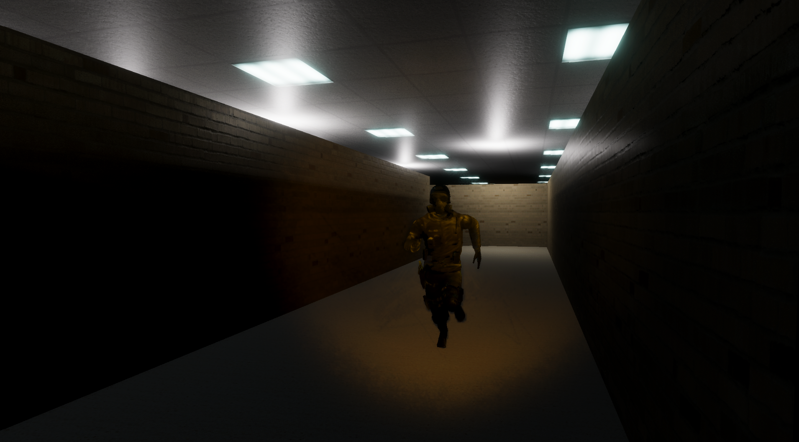
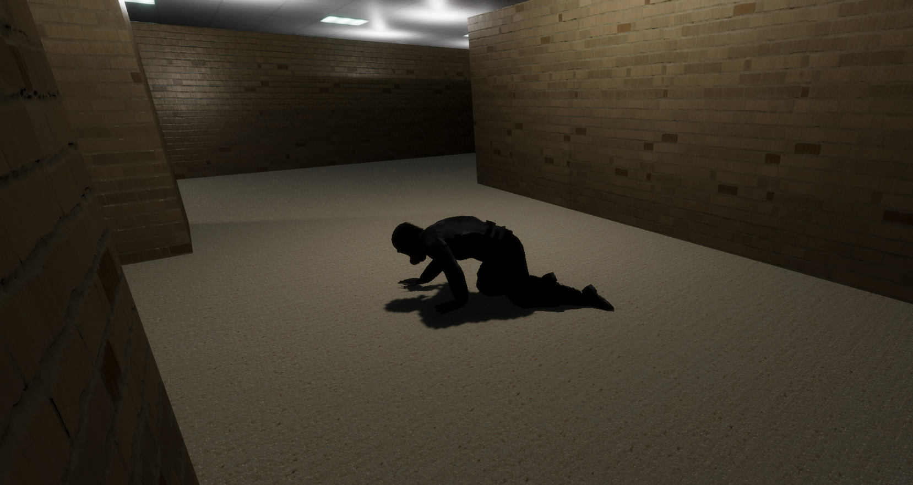
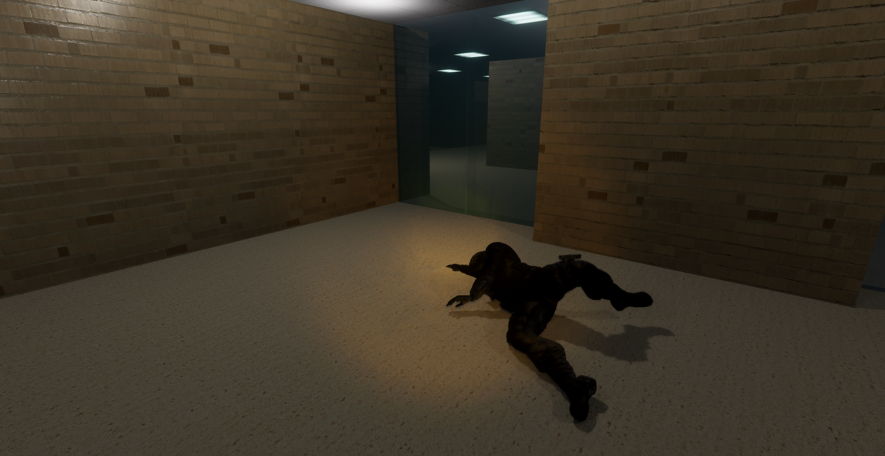

# Erweiterte Spielmechanik – Verfolger‑NPC

Dieser Zusatz‑README ergänzt die ursprüngliche Projektdokumentation um die **neue Verfolger‑Mechanik**.  
Alle Grundfunktionen (Labyrinth, Taschenlampe, Ray Tracing usw.) bleiben unverändert und sind weiterhin in der ersten README beschrieben.  
Weiter Details sind im beigefügten Bericht "Abgabe_2_Stengl.pdf" zu finden.

---

## 1 · Überblick

* Ein einzelner **Wächter‑NPC** patrouilliert jetzt das Labyrinth.
* Berührt er den Spieler **frontal**, endet die Partie (Niederlage).
* Beim **Kontakt von hinten** stolpert der Wächter, kriecht kurzzeitig langsam und steht danach wieder auf.
* Der NPC nutzt ein Geräusch‑basiertes **Suchsystem**: Er erhält nur einen Kreis (Mittelpunkt + Radius), in dem sich der Spieler irgendwo befindet.

---

## 2 · Suchradius & Spieler­einfluss

| Aktion / Situation                 | Auswirkung auf Radius | Ergebnis für den Spieler            |
|------------------------------------|-----------------------|-------------------------------------|
| Spieler **rennt**                  | Radius verkleinert    | Wächter sucht fokussierter          |
| Spieler **geht** oder steht        | Radius vergrößert     | Suche wird weiter gefasst           |
| Wächter **sprintet**               | Radius vergrößert     | Eigenlärm erschwert seine Ortung    |
| Abstand Spieler ↔ Wächter nimmt ab | Radius verkleinert    | Schritte werden deutlicher hörbar   |

Durch kontrolliertes Tempo kann der Spieler daher den Suchradius aktiv beeinflussen.

---

## 3 · Ablauf einer Begegnung

1. **Erkennen** – Der Wächter erhält den aktuellen Suchkreis.
2. **Entscheiden** – Sein KI‑Modell wählt ein Ziel innerhalb des Kreises und eine Geschwindigkeit.
3. **Annähern** – Er folgt dem berechneten Pfad (Gehen / Rennen).
4. **Kollision**
    * **Frontal** → Spielende.
    * **Von hinten** → Stolpern → Kriechen (0,5 m/s, wenige Sekunden) → Aufstehen.
5. Nach dem Aufstehen beginnt der Zyklus erneut.

---

## 5 · Spielstart

Um das Spiel zu starten, sind folgende Schritte notwendig:

1. Den vollständigen Ordner **„Abgabe 2“** herunterladen. (Den Ordner noch nicht in Unity öffnen!)
2. In der Datei "Abgabe 2\Assets\NPC\OpenAIKey.txt" einen gültigen **OpenAI API‑Schlüssel** eintragen.
3. Das NPC‑Modell unter folgendem Link herunterladen und speichern: https://jonathan-stengl.de/Ch35_nonPBR.fbx (Die Datei war zu groß für das Github-Projekt)
4. Die heruntergeladene Datei in den Ordner "Abgabe 2\Assets\NPC\" verschieben.
5. In Unity die Szene "Abgabe 2\Assets\MainScene.unity" öffnen und das Spiel starten.
  
